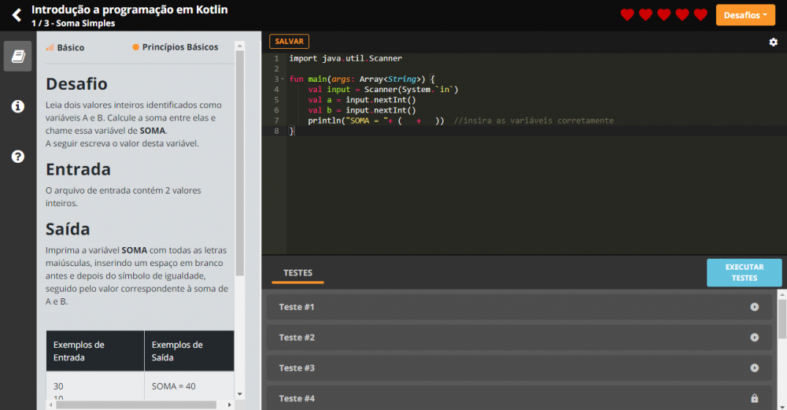
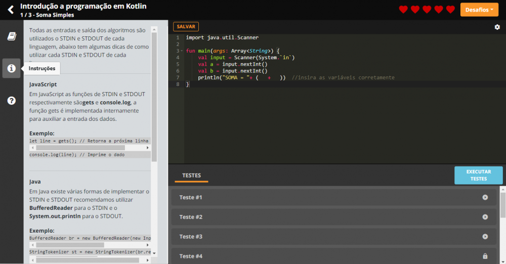
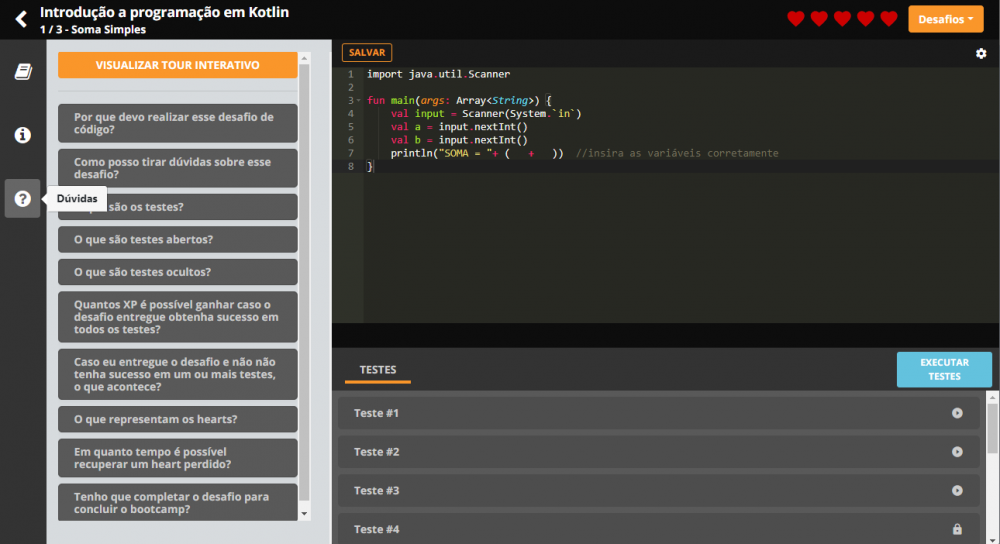
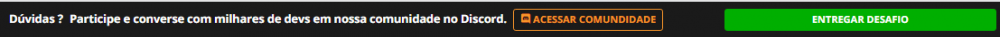

<h1 align="center"> Desafios e Soluções dos Bootcamps da Digital Innovation One :books:</h1>
 
<!--Banner session-->

  

 

<!-- PHP -->
  
  <!-- C# -->
  
  <!-- JavaScript -->
  
  
Clique no logotipo da linguagem para conferir soluções que ainda não estão listadas abaixo:

<!-- C Sharp -->

    
<strong>C Sharp</strong>

     
    

        <!-- BootCamp Pottencial .NET Developer -->
        <table border=1>
            <tr>
                <th colspan="3"><a href="https://web.dio.me/track/pottencial-net-developer">BootCamp Pottencial .NET Developer</a></th>
            </tr>
            <tr>
                <th colspan="3">Projetos do Bootcamp</th>
            </tr>
            <tr>
                <th>Desafio</th>
                <th>Solução</th>
                <th>Status</th>
            </tr>
            <tr>
                <td>Sistema de Estacionamento</td>
                <td><a href="https://github.com/heeydev/Meus-Projetos/tree/master/Todos%20os%20Materiais/C%20Sharp/BootCamp%20Pottencial%20.NET%20Developer/DesafioProjetoEstacionamento">Código</a></td>
                <td align="center">✔️</td>
            </tr>
            <tr>
                <td>Sistema de Hospedagem</td>
                <td><a href="https://github.com/heeydev/Meus-Projetos/tree/master/Todos%20os%20Materiais/C%20Sharp/BootCamp%20Pottencial%20.NET%20Developer/DesafioProjetoHospedagem">Código</a></td>
                <td align="center">✔️</td>
            </tr>
	    <tr>
                <td>Abstraindo um Sistema de Celular com POO</td>
                <td><a href="https://github.com/heeydev/Meus-Projetos/tree/master/Todos%20os%20Materiais/C%20Sharp/BootCamp%20Pottencial%20.NET%20Developer/ProjetoSistemaCelularAbstrato">Código</a></td>
                <td align="center">✔️</td>
            </tr>
		<tr>
                <td>Criando uma Agenda - Entity Framework+SQL Server) (CRUD)</td>
                <td><a href="https://github.com/heeydev/Meus-Projetos/tree/master/Todos%20os%20Materiais/C%20Sharp/BootCamp%20Pottencial%20.NET%20Developer/ProjetoAgendaCRUD%2BEntityFramework/ModuloAPI">Código</a></td>
                <td align="center">✔️</td>
            </tr>
            <tr>
                <td>Gerenciador de Tarefas - API e Entity Framework (CRUD)</td>
                <td><a href="https://github.com/heeydev/Meus-Projetos/tree/master/Todos%20os%20Materiais/C%20Sharp/BootCamp%20Pottencial%20.NET%20Developer/TrilhaApiDesafio">Código</a></td>
                <td align="center">✔️</td>
            </tr>
	    <tr>
                <td>Agenda de Contatos - Asp.NET MVC (CRUD)</td>
                <td><a href="https://github.com/heeydev/Meus-Projetos/tree/master/Todos%20os%20Materiais/C%20Sharp/BootCamp%20Pottencial%20.NET%20Developer/ProjetoMVC">Código</a></td>
                <td align="center">✔️</td>
            </tr>
            <tr>
                <td>Desafio Final Bootcamp Pottencial Payment API - Entity Framework[InMemory] (CRUD)</td>
                <td><a href="https://github.com/heeydev/Meus-Projetos/tree/master/Todos%20os%20Materiais/C%20Sharp/BootCamp%20Pottencial%20.NET%20Developer/PottencialPaymentAPI">Código</a></td>
                <td align="center">✔️</td>
            </tr>
        </table>  		
        <!-- Desafios de Cálculo BootCamp Pottencial .NET Developer -->
        <table border=1>
            <tr>
                <th colspan="3"><a href="https://web.dio.me/coding/desafios-basicos-c-pottencial/algorithm/subtraindo-o-produto-e-a-soma-de-um-numero-inteiro?back=/track/pottencial-net-developer&tab=undefined&moduleId=undefined">Desafios BootCamp Pottencial .NET Developer</a></th>
            </tr>
	    <tr>
                <th colspan="3">Desafios de Nível: Básico</th>
            </tr>
            <tr>
                <th>Desafio</th>
                <th>Solução</th>
                <th>Status</th>
            </tr>
            <tr>
                <td>Encaixa ou Não?</td>
                <td><a href="https://github.com/heeydev/Meus-Projetos/tree/master/Todos%20os%20Materiais/C%20Sharp/Desafios/C%C3%A1lculo%20B%C3%A1sico/EncaixaOuNaoEncaixa">Código</a></td>
                <td align="center">✔️</td>
            </tr>
            <tr>
                <td>Três Divisores</td>
                <td><a href="https://github.com/heeydev/Meus-Projetos/tree/master/Todos%20os%20Materiais/C%20Sharp/Desafios/C%C3%A1lculo%20B%C3%A1sico/TresDivisores">Código</a></td>
                <td align="center">✔️</td>
            </tr>
            <tr>
                <td>Subtraindo o Produto e a soma de um número inteiro</td>
                <td><a href="https://github.com/heeydev/Meus-Projetos/tree/master/Todos%20os%20Materiais/C%20Sharp/Desafios/C%C3%A1lculo%20B%C3%A1sico/VariacoesNumeroInteiro">Código</a></td>
                <td align="center">✔️</td>
            </tr>
	    </table>   
        <!-- Desafios Intermediários BootCamp Pottencial .NET Developer -->
        <table border=1>
            <tr>
                <th colspan="3"><a href="https://web.dio.me/coding/desafios-de-codigo-intermediario-c-pottencial/algorithm/elemento-majoritario?back=/track/pottencial-net-developer&tab=undefined&moduleId=undefined">Desafios BootCamp Pottencial .NET Developer</a></th>
            </tr>
	    <tr>
                <th colspan="3">Desafios de Nível: Intermediário</th>
            </tr>
            <tr>
                <th>Desafio</th>
                <th>Solução</th>
                <th>Status</th>
            </tr>
            <tr>
                <td>Elemento Majoritário</td>
                <td><a href="https://github.com/heeydev/Meus-Projetos/tree/master/Todos%20os%20Materiais/C%20Sharp/Desafios/Intermedi%C3%A1rios/Elemento%20Majoritario">Código</a></td>
                <td align="center">✔️</td>
            </tr>
            <tr>
                <td>Aumento de Salário</td>
                <td><a href="https://github.com/heeydev/Meus-Projetos/tree/master/Todos%20os%20Materiais/C%20Sharp/Desafios/Intermedi%C3%A1rios/Aumento%20de%20Sal%C3%A1rio">Código</a></td>
                <td align="center">✔️</td>
            </tr>
            <tr>
                <td>A corrida das Tartarugas</td>
                <td><a href="https://github.com/heeydev/Meus-Projetos/tree/master/Todos%20os%20Materiais/C%20Sharp/Desafios/Intermedi%C3%A1rios/A%20corrida%20das%20Tartarugas">Código</a></td>
                <td align="center">✔️</td>
            </tr>
        </table>	
        <!-- Plataforma BeeCrowd -->
        <table border=1>
            <tr>
                <th colspan="3"><a href="https://www.beecrowd.com.br/judge/en/search">Plataforma BeeCrowd</a></th>
            </tr>
            <tr>
                <th colspan="3">Desafios BeeCrowd</th>
            </tr>
            <tr>
                <th>Desafio</th>
                <th>Solução</th>
                <th>Status</th>
            </tr>
            <tr>
                <td>Desafios para Iniciantes</td>
                <td><a href="https://github.com/heeydev/Meus-Projetos/tree/master/Todos%20os%20Materiais/C%20Sharp/Desafios/Plataforma%20BeeCrowd">Código</a></td>
                <td align="center">✔️</td>
            </tr>       
        </table>	               
    

<!-- Javascript -->

    
<strong>Javascript</strong>

     
    

        <!-- BootCamp Formação Javascript Developer -->
        <table border=1>
            <tr>
                <th colspan="3"><a href="https://web.dio.me/track/formacao-javascript-developer">Bootcamp - Formação Javascript Developer</a></th>
            </tr>
            <tr>
                <th colspan="3">Projetos do Bootcamp</th>
            </tr>
            <tr>
                <th>Desafio</th>
                <th>Solução</th>
                <th>Status</th>
            </tr>
            <tr>
	    <tr>
                <td>Pokemon API</td>
                <td><a href="https://github.com/heeydev/Meus-Projetos/tree/master/Todos%20os%20Materiais/Javascript/Pokedex">Código</a></td>
                <td align="center">✔️</td>
            </tr>
	    <tr>
                <td><a href="https://github.com/heeydev/Portfolio">Portfólio Pessoal</a></td>
                <td><a href="https://github.com/heeydev/Portfolio">Código</a></td>
                <td align="center">✔️</td>
            </tr>
	    </table>
	    <!-- Desafios Básicos Formação Javascript Developer -->
        <table border=1>
            <tr>
                <th colspan="3"><a href="https://web.dio.me/coding/desafios-de-codigo-formacao-javascript-developer/algorithm/media-final-do-aluno-1?back=/track/formacao-javascript-developer&tab=undefined&moduleId=undefined">Desafios BootCamp Formação PHP Experience</a></th>
            </tr>
	    <tr>
                <th colspan="3">Desafios de Nível: Básico</th>
            </tr>
            <tr>
                <th>Desafio</th>
                <th>Solução</th>
                <th>Status</th>
            </tr>
            <tr>
                <td>Média Aluno</td>
                <td><a href="https://github.com/heeydev/Estudos/blob/master/Estudos%20Gerais%20PHP/Desafios%20Intermedi%C3%A1rios/Idade%20em%20Dias.php">Código</a></td>
                <td align="center">✔️</td>
            </tr>
            <tr>
                <td>IMC</td>
                <td><a href="https://github.com/heeydev/Estudos/blob/master/Estudos%20Gerais%20JS/FormacaoJavaScriptDeveloper/04%20-%20IMC%20com%20fun%C3%A7%C3%B5es/IMC_funcoes.js">Código</a></td>
                <td align="center">✔️</td>
            </tr>
	    <tr>
                <td>Maior Par Menor ímpar</td>
                <td><a href="https://github.com/heeydev/Estudos/blob/master/Estudos%20Gerais%20JS/FormacaoJavaScriptDeveloper/11%20-%20Desafios%20de%20C%C3%B3digo%2003/maior_par_menor_impar.js">Código</a></td>
                <td align="center">✔️</td>
            </tr>
        </table>
    

	

	
<!-- PHP -->

    
<strong>PHP</strong>

     
    

        <!-- BootCamp Formação PHP Experience -->
        <table border=1>
            <tr>
                <th colspan="3"><a href="https://web.dio.me/track/formacao-php-experience">Bootcamp - Formação PHP Experience</a></th>
            </tr>
            <tr>
                <th colspan="3">Projetos do Bootcamp</th>
            </tr>
            <tr>
                <th>Desafio</th>
                <th>Solução</th>
                <th>Status</th>
            </tr>
            <tr>
	    <tr>
                <td>Lista de Produtos (CRUD) - PHP MySQL PDO</td>
                <td><a href="https://github.com/heeydev/Meus-Projetos/tree/master/Todos%20os%20Materiais/PHP/Lista%20de%20Produtos%20(CRUD)%20-%20PHP%20MySQL%20PDO/pdo/src">Código</a></td>
                <td align="center">✔️</td>
            </tr>
	    <tr>
                <td>Lista de Posts (CRUD) - PHP MySQL PDO</td>
                <td><a href="https://github.com/heeydev/Meus-Projetos/tree/master/Todos%20os%20Materiais/PHP/Lista%20de%20Posts%20(CRUD)%20-%20PHP%20MySQL%20PDO/pdo/src">Código</a></td>
                <td align="center">✔️</td>
            </tr>
	    <tr>
                <td>Database List - API REST</td>
                <td><a href="https://github.com/heeydev/Meus-Projetos/tree/master/Todos%20os%20Materiais/PHP/Database%20List%20-%20API%20REST/API">Código</a></td>
                <td align="center">✔️</td>
            </tr>
	    <tr>
                <td>Busca CEP</td>
                <td><a href="https://github.com/heeydev/DigitalCep">Código</a></td>
                <td align="center">✔️</td>
            </tr>
	    </table>	               
    

    </table>   
        <!-- Desafios Básicos BootCamp Formação PHP Experience -->
        <table border=1>
            <tr>
                <th colspan="3"><a href="https://web.dio.me/coding/desafios-basicos-php/algorithm/soma-simples?back=/track/formacao-php-experience&tab=undefined&moduleId=undefined">Desafios BootCamp Formação PHP Experience</a></th>
            </tr>
	    <tr>
                <th colspan="3">Desafios de Nível: Básico</th>
            </tr>
            <tr>
                <th>Desafio</th>
                <th>Solução</th>
                <th>Status</th>
            </tr>
            <tr>
                <td>Distância</td>
                <td><a href="https://github.com/heeydev/Estudos/blob/master/Estudos%20Gerais%20PHP/Desafios%20B%C3%A1sicos/distancia.php">Código</a></td>
                <td align="center">✔️</td>
            </tr>
            <tr>
                <td>Salário</td>
                <td><a href="https://github.com/heeydev/Estudos/blob/master/Estudos%20Gerais%20PHP/Desafios%20B%C3%A1sicos/salario.php">Código</a></td>
                <td align="center">✔️</td>
            </tr>            
        </table>
	</table>   
        <!-- Desafios Intermediários BootCamp Formação PHP Experience -->
        <table border=1>
            <tr>
                <th colspan="3"><a href="https://web.dio.me/coding/formacao-php-desafios-intermediarios/algorithm/idade-em-dias?back=/track/formacao-php-experience&tab=undefined&moduleId=undefined">Desafios BootCamp Formação PHP Experience</a></th>
            </tr>
	    <tr>
                <th colspan="3">Desafios de Nível: Intermediário</th>
            </tr>
            <tr>
                <th>Desafio</th>
                <th>Solução</th>
                <th>Status</th>
            </tr>
            <tr>
                <td>DDD</td>
                <td><a href="https://github.com/heeydev/Estudos/blob/master/Estudos%20Gerais%20PHP/Desafios%20Intermedi%C3%A1rios/DDD.php">Código</a></td>
                <td align="center">✔️</td>
            </tr>
            <tr>
                <td>Idade em Dias</td>
                <td><a href="https://github.com/heeydev/Estudos/blob/master/Estudos%20Gerais%20PHP/Desafios%20Intermedi%C3%A1rios/Idade%20em%20Dias.php">Código</a></td>
                <td align="center">✔️</td>
            </tr>
	    <tr>
                <td>Notas e Moedas</td>
                <td><a href="https://github.com/heeydev/Estudos/blob/master/Estudos%20Gerais%20PHP/Desafios%20Intermedi%C3%A1rios/Notas%20e%20Moedas.php">Código</a></td>
                <td align="center">✔️</td>
            </tr>
        </table>
	

## Resolvendo um desafio de código na prática

Para te auxiliar na conclusão do bootcamp, a equipe da DIO realizou uma live explicando o passo a passo sobre como resolver os desafios de código, confira no Youtube:

[LIVE - Resolvendo um desafio de código na prática](https://www.youtube.com/watch?v=I8NI5QNUCe8)

Há também um mini-curso e uma mentoria dentro da plataforma (Precisa estar logado):
- [Resolvendo Desafios de Código em Java](https://web.dio.me/course/resolvendo-desafios-de-codigo-em-java/learning/3191f44c-6b79-4a0c-90b7-d9b65b49b7aa?back=/track/everis-new-talents-3-java
)

- [
Mentoria DIO: Como Resolver desafios de código na sua jornada como dev](https://web.dio.me/live/como-resolver-desafios-de-codigo-na-sua-jornada-como-dev-dio/learning/1869e000-8ca5-42df-9a94-7c2c62579405?back=/track/impulso-react-web-developer)

Esses desafios lhe ajudarão a praticar e aplicar os conceitos apresentados nas aulas e exercícios. Para ter destaque na carreira de desenvolvimento de software é necessário praticar muito com algoritmos.

  

O desafio lhe propõe praticar o pensamento computacional, exigindo a criação de uma solução implementada através do seu código com um conjunto de entradas e saídas esperadas.

Na área especificada acima, você deve digitar o seu código para a solução do desafio.

Clicando no botão "SALVAR", você pode ir salvando o seu código conforme for desenvolvendo.

No ícone de engrenagem, localizado no canto superior direito, você pode alterar as configurações do editor e deixar com a sua cara.

  

Ao clicar em instruções, confira algumas intruções e dicas para implementação da sua solução.

Em "TESTES", ficarão todos os testes que serão executados junto a sua implementação da solução.

Os testes abertos (▶) podem ser executados a qualquer momento para você avaliar o código criado como solução para o desafio.
Os testes com cadeados (🔒) são ocultos e apenas serão executados quando você decidir entregar o seu código.

Através do botão "EXECUTAR TESTES", execute os testes abertos a qualquer momento para você avaliar o código criado como solução para o desafio.

  

## [Discord](https://discord.com/invite/MUdRyVg)
 
Você também pode tirar dúvidas com milhares de Devs em nossa comunidade no Discord, acesse o link localizado no rodapé da página ou clique [aqui](https://discord.com/invite/MUdRyVg)

  

Após revisado e testado o seu código, você deve clicar no botão "ENTREGAR DESAFIO", para avaliação em tempo real.

## 🐛 Issues

Sinta-se à vontade para registrar um novo problema com o respectivo título e descrição no repositório do projeto. Se você já encontrou uma solução para seu problema, adoraria revisar sua solicitação de pull!

## 🤝 Contribuições

Siga os passos abaixo para contribuir:

1. Faça o *fork* do projeto (https://github.com/shyoutarou/desafios-DIO.git)

2. Clone o seu *fork* para sua maquína (`git clone https://github.com/user_name/Material-de-Estudo.git`)

3. Crie uma *branch* para realizar sua modificação (`git checkout -b feature/name_new_feature`)

4. Adicione suas modificações e faça o *commit* (`git commit -m "Descreva sua modificação"`)

5. *Push* (`git push origin feature/name_new_feature`)

6. Crie um novo *Pull Request*

7. Pronto, agora só aguardar a análise 🚀 

## 📜 License

O projeto lançado em 2021 sobre a licença [MIT](./LICENSE) ❤️ 

Made with ♥ by Shyoutarou

Gostou? Deixe uma estrelinha para ajudar o projeto ⭐
